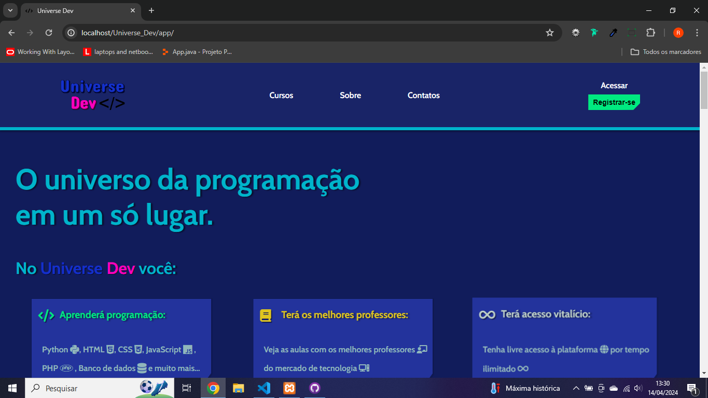
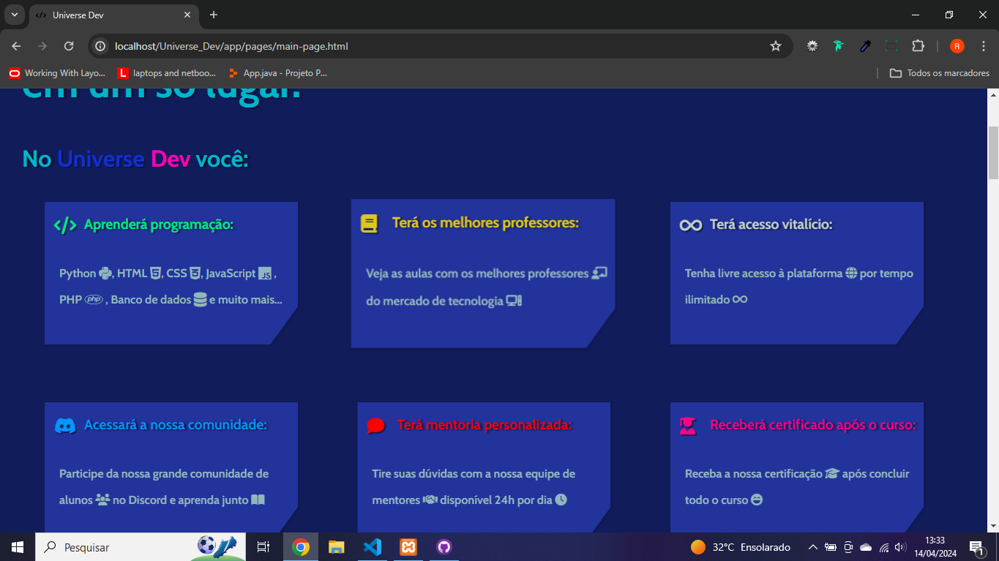
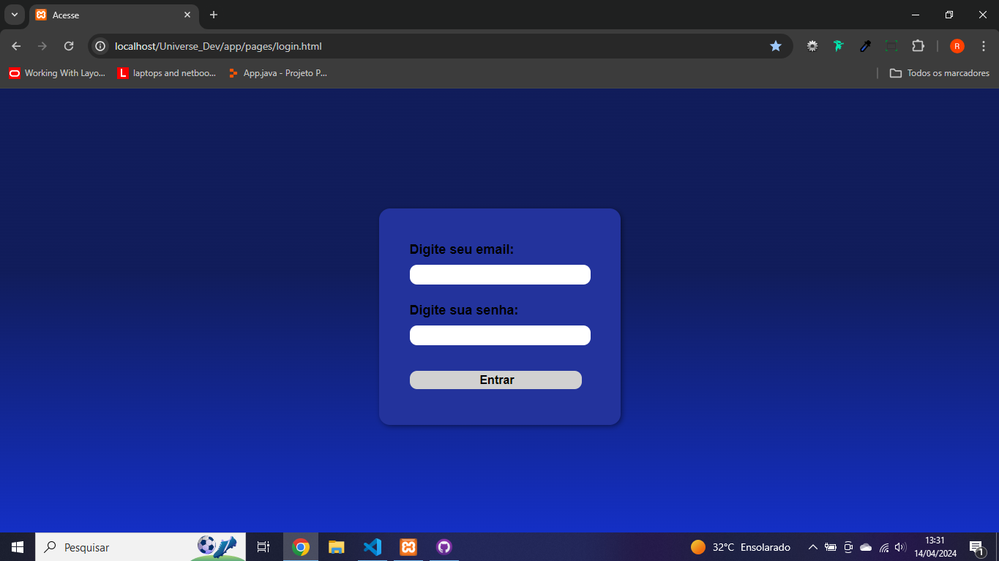
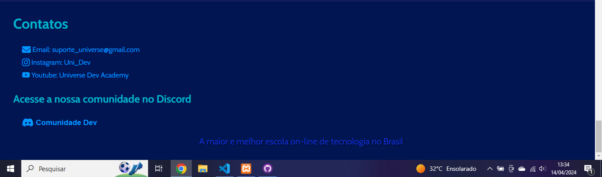

# Seja bem-vindo ao universo da programação!!!

## Em minha jornada como desenvolvedor web, busco aprender cada vez mais.

Meu segundo site é inspirado na Alura, um site de cursos online sobre tecnologia. Este site tem um design simplista, pois não sou tão bom nesse aspecto, mas não é uma cópia do layout da Alura.

A ideia do site é ter uma página principal que mostre um pouco dos cursos disponíveis, um vídeo de apresentação, uma área "Sobre" e os contatos ao final. Quando o usuário fizer login, o site irá apresentar os preços de cada curso e também mostrar mais das vantagens de estudar no Universe Dev. Inicialmente, essa parte dos preços ainda não foi implementada, mas futuramente poderei fazer isso.

## Seguem algumas imagens do site:

### Página inicial:

### Cursos:

### Login:

### Contato:

### Tecnologias usadas no projeto:

